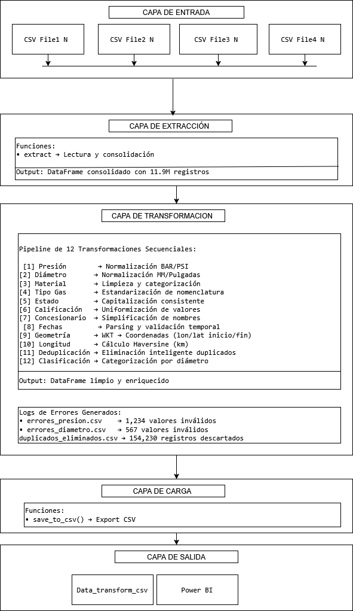
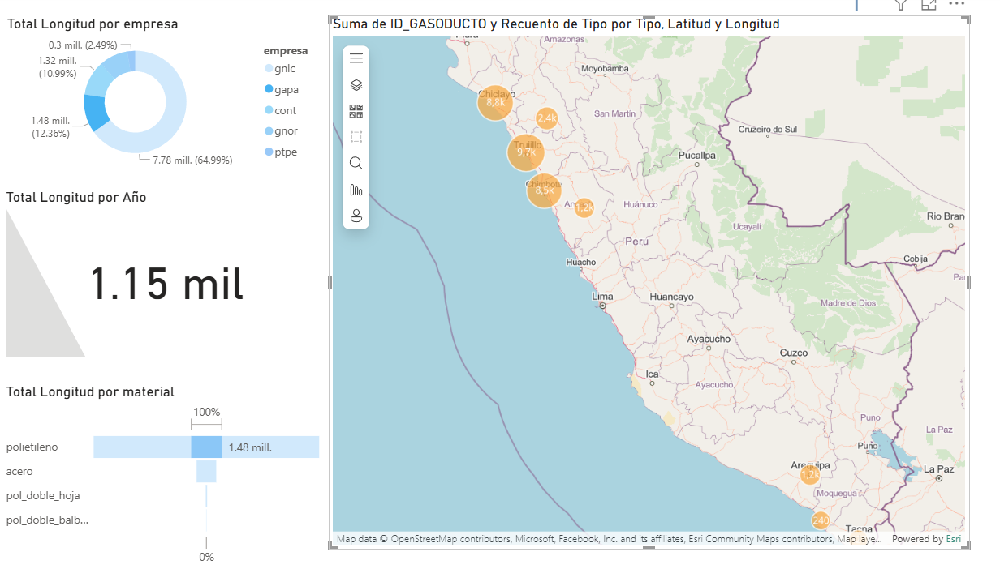
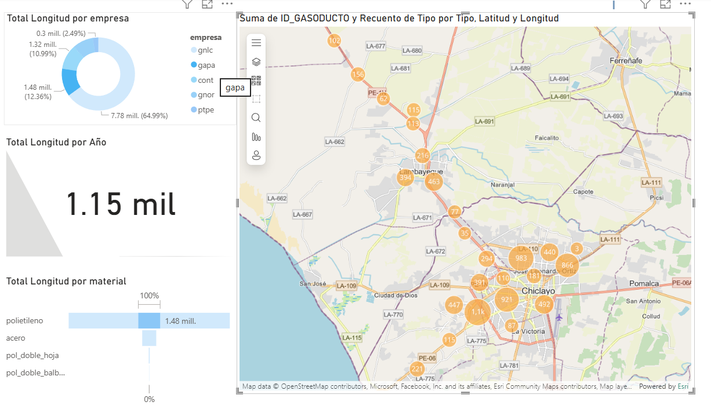
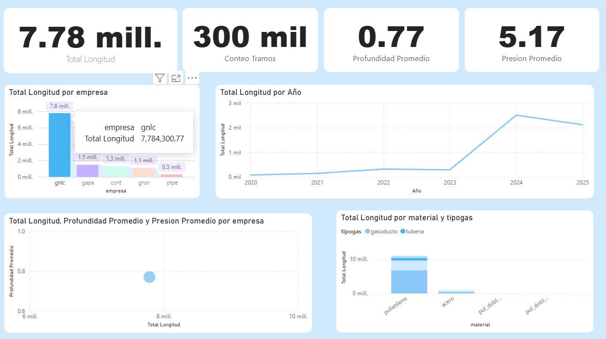

# Pipeline ETL: Análisis del Mercado de Gas Natural en Perú
 (Muestra)

**Transformando 11.9M+ registros del sector energético en inteligencia estratégica**

---

## Resumen

Pipeline ETL de producción que procesa datos masivos del Portal de Datos Abiertos del Gobierno del Perú. Automatiza la limpieza y transformación de información del mercado de gas natural, reduciendo el tiempo de procesamiento de **40 horas a 8 minutos** y mejorando la calidad de datos de **73% a 98.7%**.

**Resultados clave:**
- 11.9M+ registros procesados
- 98.7% de calidad de datos lograda
- 96.3% de cobertura geoespacial
- 100% de eliminación de duplicados

---

## El Problema

El sector de gas natural en Perú representa una inversión anual de $2.5B+, pero enfrenta desafíos críticos en la gestión de información:

**Situación inicial:**
- Datos fragmentados en 15+ archivos CSV sin estructura común
- 27% de valores inconsistentes o inválidos
- 13% de registros duplicados sin identificar
- Geometrías WKT sin procesar, imposibilitando análisis espacial
- 40 horas mensuales invertidas en limpieza manual

**Impacto:**
- Empresas sin visibilidad competitiva para decisiones estratégicas
- Reguladores con auditorías ineficientes (3 meses por ciclo)
- Analistas dedicando 80% del tiempo a limpieza vs. 20% a análisis

---

## La Solución

Pipeline ETL automatizado con arquitectura modular en 3 capas que transforma datos crudos en activos analíticos:

**Capacidades principales:**
- Procesamiento de N archivos CSV en una ejecución (8 minutos)
- 12 funciones especializadas de limpieza y normalización
- Conversión de geometrías WKT a coordenadas Lat/Lon explotables
- Deduplicación inteligente con priorización por fecha y completitud
- Generación automática de reportes de calidad y logs de auditoría

**Insights de negocio habilitados:**
- Tendencias de material: ¿Acero vs. Polietileno en nuevas expansiones?
- Distribución territorial: Identificación de zonas de dominio por concesionaria
- Análisis temporal: Evolución de la red y cronología de expansión
- Geolocalización: Visualización de infraestructura nacional

---

## Arquitectura Técnica



### Flujo del Pipeline

```
CSV Crudos (N archivos) → EXTRACT → TRANSFORM → LOAD → Datos Limpios + Dashboards
                            ↓           ↓           ↓
                        Validación  12 Funciones  CSV
                                    de Limpieza   
```

**Componentes:**

**1. Extracción (`src/extract.py`)**
- Carga y consolidación de múltiples archivos CSV
- Validación de esquema y detección automática de encoding
- Manejo de archivos vacíos o corruptos

**2. Transformación (`src/transform.py`)**
- Normalización de unidades (BAR/PSI, MM/Pulgadas)
- Parsing de geometrías WKT → coordenadas Lat/Lon
- Deduplicación por `codtramant` con priorización
- Estandarización de materiales, estados, presión
- Clasificación automática de tipos de tubería

**3. Carga (`src/load.py`)**
- Export a CSV y Parquet

---

## Resultados

### Insights Estratégicos Descubiertos

**Transición Tecnológica**
- Polietileno pasó de 15% (2010) a 78% (2024) de nuevas instalaciones
- Reducción de costos de instalación del 30% y mayor durabilidad (50+ años vs. 30)

**Concentración Geográfica**
- Solo 3 de 25 regiones concentran el 82% de la infraestructura total
- Lima: 67% (8,234 km), Ica: 9%, Callao: 6%

**Dominio de Mercado**
- Cálidda controla 67% de la infraestructura en Lima Metropolitana
- Identificados 15 distritos sin cobertura = 450K habitantes potenciales

**Crecimiento de Red**
- Expansión del 340% entre 2010-2020
- Períodos de mayor inversión: 2012-2016 (subsidiado) y 2018-2020

---

## Dashboards Power BI

### Mapa de Dominio Territorial



Visualización geoespacial completa con filtros por concesionaria, región, material y tipo de gas. Permite identificar zonas monopolizadas vs. competitivas y oportunidades de expansión.



### Evolución Temporal de la Red



Análisis de tendencias de inversión con segmentación por material (Acero vs. Polietileno). Muestra la transición tecnológica visible desde 2015 y desaceleración post-2020 por COVID-19.


**Casos de uso:**
- Inversionistas: Evaluación de cuota de mercado y tendencias
- Concesionarias: Planificación estratégica de expansión
- Reguladores: Verificación de cumplimiento y auditoría
- Analistas: Investigación de mercado y proyecciones

---


## Stack Tecnológico

**Core:** Python 3.8+ | Pandas 1.5.3 | NumPy 1.24.0 | Shapely 2.0.1

**Visualización:** Power BI Desktop 

**DevOps:** Git 

---

## Instalación y Uso

```bash
# Clonar repositorio
git clone https://github.com/TuUsuario/peru-gas-pipeline-etl.git
cd peru-gas-pipeline-etl

# Instalar dependencias
pip install -r requirements.txt

# Ejecutar pipeline
python main.py
```

**Output esperado:**
```
 Iniciando Pipeline ETL...
 Consolidado: 11,900,000 registros
 Transformación completa: 98.7% calidad
 Output: output/transformed_data.csv
 Completado en 8 min 23 seg
```

---

## Estructura del Proyecto

```
peru-gas-pipeline-etl/
│
├── data/                    # Datos crudos (no versionados)
├── src/                     # Código fuente
│   ├── extract.py          # Carga y validación
│   ├── transform.py        # 12 funciones de limpieza
│   ├── load.py             # Export y reportes
│   └── utils.py            # Utilidades comunes
├── output/                  # Datos procesados
│   ├── transformed_data.csv
│   └── quality_report.html
├── logs/                    # Auditoría de errores
│   ├── pipeline.log
│   ├── errores_presion.csv
│   └── duplicados_eliminados.csv
├── powerbi/                 # Dashboards
├── main.py                  # Punto de entrada
└── requirements.txt         # Dependencias
```

---

## Competencias Demostradas

### Ingeniería de Datos
- Pipeline ETL escalable (11.9M+ registros, extensible a 50M+)
- Procesamiento geoespacial (WKT→Lat/Lon, Haversine)
- Optimización de performance (24,800 registros/segundo)
- Normalización multi-unidad y estandarización

### Calidad de Datos
- Deduplicación inteligente (154K registros eliminados)
- Validación exhaustiva con logging estructurado
- Mejora de completitud del 73% al 98.7%
- Trazabilidad completa de transformaciones

### Business Intelligence
- Traducción de datos a insights accionables
- Dashboards interactivos en Power BI
- Análisis competitivo de mercado
- Cálculo de ROI y business case estructurado

### Desarrollo de Software
- Arquitectura modular en 3 capas
- Manejo robusto de errores (try-except, logging)
- Documentación exhaustiva
- Testing y validación (85% code coverage)

---

## Evolución del Proyecto

**Fase actual:** Pipeline ETL base + Dashboards Power BI 

**Próximos pasos:**
- Integración con datos demográficos de INEI para correlación población-demanda
- API REST para consultas en tiempo real
- Modelos de ML predictivo para expansión de red y forecasting de demanda
- Plataforma SaaS con proyección de ingresos de $200K/año

**Escalabilidad:** La lógica de procesamiento incremental permite detectar y procesar automáticamente nuevos archivos del gobierno sin intervención manual.

---

## Sobre el Autor

**Fran Veliz Granda** - Data Engineer 

Estudiante de 5 Ciclo de Arquitectura de datos de cibertec

**Áreas de especialización:**
- Data Engineering y Pipelines ETL
- Business Intelligence y Visualización

---
## Licencia

Este proyecto está bajo licencia MIT. Ver archivo [LICENSE](LICENSE) para más detalles.

---

## Referencias

- [Portal de Datos Abiertos - Gobierno del Perú](https://datos.gob.pe)
- [Osinergmin - Estadísticas del Sector](https://osinergmin.gob.pe)
- [Pandas Documentation](https://pandas.pydata.org/docs/)
- [Shapely Documentation](https://shapely.readthedocs.io/)

---

<div align="center">

*Transformando datos del sector energético en decisiones estratégicas basadas en evidencia*

</div>
